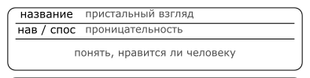

# 2 Creating character

## Name, concept and personality

You can start creating character with name, concept or personality.

>Janna prepared a game where PCs are going to participate in treasure hunt.
>Ann, Bridget and Violet are creating characters.
>
>Ann starts with the name - _Anaxiel the Third_. From it she concludes that her character is some sort of noble.
>
>Bridget starts with the concept - her character is earth battle mage. She decides his name is Big Bo.
>
>Violet starts with personalty - her character is awkward scientist. Her name is Witmore Smith.

## Level and advancement points

Level describes how well character is at using their skills and abilities.
Level can take values from `0` up to `10`.
Level of PCs at the beginning of the game is decided by GM.

>Janna decides PC start with level 1.
>
>

Every character has `10` advancement points, this points can be spend to learn skills and abilities.

## Traits

Every character has `3` traits.
Trait is storywise important fact that can be both advantageous and disadvantageous for character. 

Good trait:
- Describes character making them different from others.
- Is easy to understand.
- Makes character multifaceted.

Recommended trait list:
- Trait that makes character the protagonist,
  answers _why this character should be in spotlight_, _who they are_.
- Trait that makes character the part of the story,
  answers _why this character should be in this particular adventure_, _what do they want_.
- Trait that make character the part ot the team,
  answers _why this character should be in this particular group_, _how are they connected to other characters_.

Things to consider when creating a trait:
- Personality.
- Origin.
- Occupation.
- Relations.
- Goals.

To make trait interesting try to make it into:
- Catch phrase.
- Word play.

>Since Anaxiel is noble, Ann think she desires luxury,
>Anaxiel knows precise cost of anything but rarely controls her greed,
>Ann names this trait as _The Crow of Noble Nest_.
>
>Big Bo despite his occupation and looks is actually very soft man,
>he is good at being soul of the group but only if someone sees his true nature behind his appearance first,
>Bridget names this trait as _Teddy. Bear._
>
>Witmore Smith is obsessed with her archeology work,
>she will solve any science problem with ease, but another human being is enigma for her,
>Violet names this trait as _Books are better than people_.
>
>

## Skills

Character can spend `1` advancement point to learn a skill.

Full list of available skills is given on setting sheet provided by GM.

>Anaxiel spends 6 AP to learn _Negotiation_, _Bluff_, _Insight_, _Resourcefulness_, _Magic_ and _Riding_. 
>
>Bo spends 3 AP to learn _Unarmed combat_, _Athletics_ and _Insight_.
>
>Witmore spends 2 AP to lear _Archeology_ and _Analysis_.

## Abilities

Character can spend `1` advancement point to learn an ability.

Full list of available abilities is given on setting sheet provided by GM.

>Anaxiel spends 4 AP to learn _Creation_, _Transformation_, _Preservation_ and _Enchantment_.
>
>

## Modifiers and items

Modifiers are added to skill or ability level or any other value.
Modifiers are provided by effects, story situations and any other reasons.

One of modifier sources are items character has.

Full list of items available in character creation is given on setting sheet provided by GM.

>
>
>
>
>

## Talents

Talent is much narrower use of skill or ability.

For skill-based talents conditions in which they can be used must be met in less that half the cases.

For ability-based talents the concrete usage of ability should be specified.

Character obtains `2` new talents with each level.

Things to consider when crating talent:
- What action character wouldn't want to fail.
- Does character has talents related to investigation, negotiation, action or any other frequent activity.

>Anaxiel's talens is to understand if other person likes her (the narrower use of Insight skill),
>Ann names it _Penetrative stare_.
>
>Her second talent is to change lighting to look more attractive (the concrete use of Transformation ability and Magic skill),
>_Spotlight_.
>
>Bo's talent is hooking (Athletics skill), Bridget names it what it is _Hooking_.
>
>Bo's second talent is grappling a leg with the earth (Transformation ability and Magic skill), _Bear trap_. 
>
>Witmore's talent is quick understanding of new date (Analysis skill), _Fast reading_.
>
>Witmore's second talent is animating tiny golems from junk (Animation ability) _Tiny helper_.
>
>
>
>