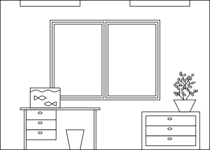
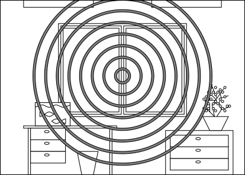
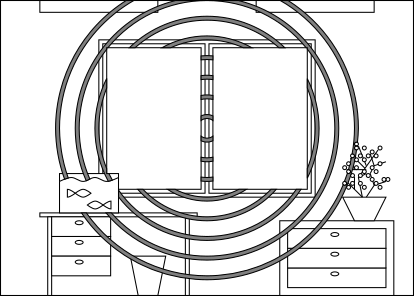
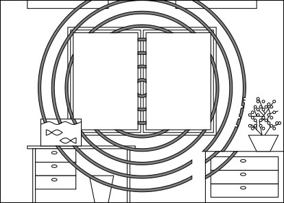

# 2 Расследование

## Улики

Расследование строится на обнаружении и анализе улик. Улика - имеющая значение для расследования информация.

По влиянию на ход расследования и сюжета улики делятся на:
- Ключевые - без них продвижение дальше невозможно.
- Дополнительные - без них продвижение дальше возможно, не обязательно наиболее оптимальным или даже верным путём.

По способу обнаружения улики делятся на:
- Очевидные - персонажу достаточно оказаться рядом.
- Неочевидные - обнаруживаются, если правильно или тщательно искать.
- Специальные - обнаруживаются, только если персонаж владеет опредённым навыком, знаниями или проходит проверку.

Ключевые улики по умолчанию должны быть очевидными.
Ключевые улики могут быть неочевидными или специальными, если обнаружение других ключевых улик рано или поздно сделает эти очевидными.

Дополнительные улики могут быть любыми по обнаружению.

Один и тот же предмет может одновременно давать ответы на несколько вопросов, таким образом являясь несколькими уликами.

>Герои осматривают комнату, где хранился ключ, замок не взломан (ключевая улика, на неё указывает владелец, который разбирается в замках),
>от окна из комнаты до окна соседнего дома меньше метра (ключевая улика, очевидная),
>в комнате есть следы применения магии (дополнительная улика, требует тщательного поиска для обнаружения),
>это была магия аспекта металла (дополнительная улика, требует знакомства с магией металла для обнаружения).

## Следы магии

Магия течёт через всё существующее пространство.
Через твёрдые тела - труднее чем через жидкости, а через жидкости - труднее чем через газы.
Живые тела куда легче проводят магию, чем должны твёрдые тела.

Некоторые вещества в твёрдом виде настолько сильно блокируют течение магии, что мешают применять заклинания.
Такие вещества называют диа-магическими.

Магические явления, в том числе заклинания, оставляют следы - уплотнения на магическом поле,
которые подобно кругам на воде впечатываются в окружение.
Круги тем интенсивнее, больше в размерах и дольше присутствуют, чем сильнее было заклинание.

Все магические существа способны использовать магическое зрение (или другой способ восприятия), чтобы увидеть следы магии.

Следы магии тем интенсивнее, чем больше очков способностей было использовано.

Магические существа могут маскировать следы своей магии.
Для этого необходимо использовать способности, обратные использованным при сотворении оригинального заклинания.
Необходимо использовать столько же очков способностей.

Следы имеют свойства, которые можно за неимением аналогов назвать цветом и текстурой.
Цвет зависит от аспекта магии. Текстура зависит от использованной при сотворении заклинания способностей.

Заклинатели без проблем идентифицируют свой аспект, знакомые им способности и тем более заклинания.
Незнакомые способности, аспекты, необычное применение, неочевидные заклинания осложняют определение всех параметров.

Раундов, потраченных на использование магического зрения | Получаемая информация о следах
-|-
1 | Наличие или отсутствие
2 | Интенсивность
3 | Цвет и текстура

>
>
>Заклинание применяется в центре комнаты.
>
>
>Следы магии в воздухе за окном, на рыбах и цветке растворяются. 
>
>
>Следы магии в воде растворяются.
>
>
>Кто-то подвинул комод.
>

## Навыки в расследовании

Во время расследования персонажи используют:
- Внимательность - для поиска неочевидных улик.
- Соответствующий навык - для поиска специальных улик.
- Анализ или находчивость - для восстановления картины произошедшего по частичной информации.