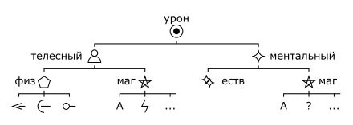

# 3 Здоровье и статусы

## Здоровье

Персонаж имеет две линии здоровья: для телесного и для ментального здоровья соответственно.
Линия здоровья состоит из 5 слотов здоровья от `1` до `5`.
Слот здоровья может быть свободным или потеряным.

Текущие свободные слоты называются ступеням и обозначаются `I`, `II`, `III`, `IV`, `V`.

>У Большого Бо свободны все слоты, поэтому для него 1 = I, 2 = II, 3 = III, 4 = IV, 5 = V.
>
>У Анаксиэль заняты слоты 1 и 4, поэтому для неё 2 = I, 3 = II, 5 = III.

При получении урона, персонаж теряет слот здоровья той же ступени что и величина урона.

>Большой Бо столкнулся с неприятностями и получает 2 урона, он теряет `II` ступень / `2` слот телесного здоровья.
>Теперь для него 1 = I, 3 = II, 4 = III, 5 = IV.
>
>Бо продолжает попадать в неприятности и получает 1 урона, он теряет `I` ступень / `1` слот телесного здоровья.
>Теперь для него 3 = I, 4 = II, 5 = III.

Если у персонажа нет слота здоровья, который он мог бы потерять из-за полученного урона, персонаж теряет сознание.

>Бо, будучи тем кто он есть, получает 3 урона, он теряет `III` ступень / `5` слот телесного здоровья.
>Теперь для него 3 = I, 4 = II. Если Бо получит 3 или больше урона, он потеряет создание.

Персонаж по своему желанию может решить принять урон в слот выше ступенью чем требуется.

Во время полного отдыха персонаж может восстановить 2 слота.
При восстановлении потеряный слот становится свободным за счет потери свободного слота ниже;
другими словами - урон перекладывается на один слот вниз.
Слот `1` можно восстановить всегда.

Хорошие условия отдыха увеличивают число освобождаемых слотов до 3, плохие - уменьшают до 1.

>Бо укладывается в королевскую постель после сытного ужина и промывания ран, он может освободить 3 слота.
>Бо освобождает слот `1`. Затем `2` за счет `1`, и `3` за счет `2`.
>Теперь для Бо 3 = I, 4 = II, 5 = III.

>Витмор попадет в похожую ситацию - теряет `1`, `2` и `3` слоты ментального здоровья, изучая записки безумцев ночь напролет.
>Она спит весь день и следующую ночь, поэтому также освобождает 3 слота.
>Витмор освобождает `1`, затем `2` за счет `1` и снова `2`.
>Теперь для Витмор 1 = I, 2 = II, 4 = III, 5 = IV.

>Анаксиэль получает `3` урона, затем `1` и затем `2`, после чего восстанавливает `1` и `3` за счет `2`.

## Группы, типы, подтипы урона

Классификация урона обозначается как _Группа : Тип : Подтип_.

Весь урон делится на две группы:
- Телесный.
- Ментальный.

Телесный урон делится на два типа:
- Телесный : Физический.
- Телесный : Магический.

Телесный физический урон делится на три подтипа:
- Телесный : Физический : Колющий.
- Телесный : Физический : Режущий.
- Телесный : Физический : Дробящий.

Телесный магический урон делится на множество подтипов, некоторые из них:
- Телесный : Магический : Арканный.
- Телесный : Магический : Огненный.
- Телесный : Магический : Электрический.
- ...

Ментальный урон делится на два типа:
- Ментальный : Естественный.
- Ментальный : Магический.

Ментальный магический урон делится на множество подтипов, некоторые из них:
- Ментальный : Магический : Арканный.
- Ментальный : Магический : Мистический.
- ...

Классификация урона влияет на то, какая линия здоровья примет урон.
Иногда персонажи могут обладать уязвимостью или устойчивостью к определенному классу урона,
что влияет на их модификатор защиты; или же полной невосприимчивостью к определённому классу урона.

## Статусы

Статусы - прочие состояния, не являющиеся физическими или ментальными повреждениями,
такие как _удушье_, _отравление_, _голод_, _усталость_, _обморожение_.

При подвержении статусу персонаж получает линию этого статуса, имеющую слоты от `1` до `5`.
Правила потери слотов действуют также как и для здоровья.
При потере всех свободных слотов возможны различные эффекты, зависящие от самого статуса.

Восстановление и облегчение статусов также целиком зависит от их природы.

>Герои третий день путешествуют через всю страну, не давая себе отдохнуть, они приобретают статус _Усталость_.
>
>Мастер решает, что при потере всех слотов, персонаж просто рухнет и будет беспробудно спать.
>
>Мастер также решает, что все слоты вернутся при полном отдыхе.

## Временные слоты

Иногда персонажи могут получать временные слоты здоровья.
Временные слоты могут быть любого уровня.
Линия здоровья не может иметь больше 1 временного слота каждого уровня.

>Бо выпивает зелье защиты и получает временный слот `(1)` физического здоровья.
>Теперь для него (1) = I, 3 = II, 4 = III, 5 = IV.
>
>Анаксиэль выпивает зелье защиты и получает временный слот (1) ментального здоровья.
>Теперь для неё 1 и (1) = I, 2 = II, 3 = III, 4 = IV, 5 = V. 

При получении урона временный слот полностью исчезает. При этом временный слот теряется первоочереднее чем обычный.

>Когда Анаксиэль получает 1 ментального урона, он теряет слот (1).

Временные слоты также учитываются при потере сознания.

>Витмор потеряла все слоты ментального здоровья, но всё ещё имеет временный слот `(3)`, поэтому находится в сознании.

Временные слоты полностью исчезают при полном отдыхе. Их нельзя использовать для восстановления обычных слотов.

>