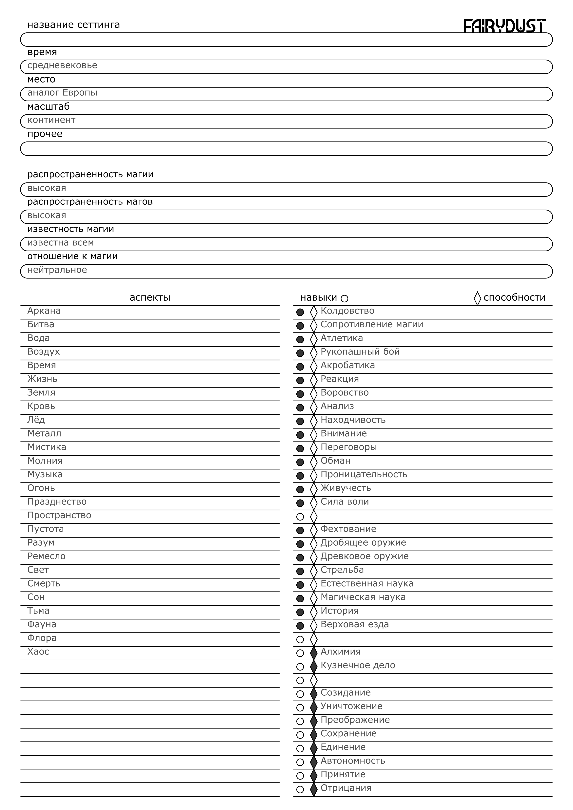

# Фэнтези
 

## Инвентарь

### Инструменты

Инструмент | Модфикатор | Навык | Цена
-|-|-|-
Лом | - | - | 10
Факел | - | - | 10
Увеличительное стекло | +1 | Внимание | 10 

### Оружие

Оружие | Базовый урон | Модфикатор | Навык | Цена
-|-|-|-|-
Нож | I режущий | -1 | Фехтование | 40
Меч | | | |
Булава | | | |
Топор | | | |
Копье | | | |
Алебарда | | | |
Лук | | | |
Арбалет | | | |

### Палочки

Палочка | Модификатор колдовства | Модификатор способности | Цена
-|-|-|-
1 | +1 | 0 | 10 
2 | 0 | +1 | 90

### Щиты

Щит | Модификатор защиты | Тип урона | Цена
-|-|-|-
Баклер | +1 | Телесный:Физический | 40

### Экипировка

Экипировка | Модификатор | Навык | Цена
-|-|-|-
Представительная одежда | +1 | Переговоры | 10
Седло | +1 | Верховая езда | 10

### Броня

Броня | Модификатор защиты | Тип урона | Цена
-|-|-|-
Кожаная броня | +1 | Телесный:Физический | 40
Кольчужная броня | | |
Пластинчатая броня | | |

### Амулеты

Амулет | Модификатор | Навык | Цена
-|-|-|-
Малый амулет защиты от магии | +1 | Сопротивление магии | 10

### Зелья

Зелье | Эффект | Цена
-|-|-
Зелье здоровья | Временный слот I на 1/2 минуты | 160
