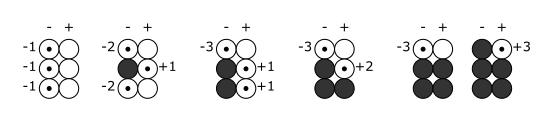

# 2 Черты и таланты

## Использование черт

Персонаж может использовать черту, если:
- В текущий момент эта черта имеет непосредственное отношение к истории.
- Черта может служить препятствием (использовать отрицательно) или преимуществом (использовать положительно) в текущей ситуации.
- Черта ещё не была использована таким способом (отрицательно/положительно).
- (Только при использовании положительно) Черта уже была использована отрицательно.

При использовании черты:
- Персонаж проходит проверку с препятствием (при использовании отрицательно) или с преимуществом (при использовании положительно).
- Персонаж получает дополнительно препятствие или преимущество за каждую черту уже использованную таким же образом.

>Бо пытается выяснить, снимал ли в таверне номер человек, которого ищут герои.
>Он использует черту _Плюшевый. Медведь._ отрицательно, владелец таверны принимает вопрос за угрозу и выгоняет Бо прочь.

>В следующей таверне Бо пытается разговориться с завсегдатаем и использует эту же черту положительно,
>он проходит проверку эмпатии с преимуществом и достигает успеха.

>Использованные черты закрашены, а черты, которые могут быть использованы, отмечены точкой.
>"-" и "+" обозначают препятствие и преимущество, обеспечиваемые использованием черты, а цифра рядом - его степень.
>

>Витмор уже использовала одну черту обоими способами и использовала черту _Книги понятнее чем люди_ только отрицательно.
>Когда она в очередной раз перерывает библиотеку в поисках ответов, она использует _Книги понятнее чем люди_ положительно.
>У неё уже есть одна положительно использованная черта, поэтому Витмор проходит проверку анализа с двойным преимуществом.
>
>Анаксиэль использовала все черты отрицательно и все, кроме _Ворона из дворянского гнезда_, положительно.
>Герои пытаются угнаться за подручным Маски, который увозит на карете ключ к поиску сокровищ.
>Анаксиэль не может позволить драгоценностям ускользнуть из её рук и прыгает на карету,
>используя черту _Ворона из дворянского гнезда_ положительно.
>Она уже имеет две положительно использованных черты, поэтому проходит проверку атлетики с тройным преимуществом.

Факт использования черт обнуляется одновременно для всех игроков по решению мастера, обычно в конце игровой сессии.

## Использование талантов

При использовании таланта, персонаж проходит проверку навыка с преимуществом.

Таланты можно использовать сколько угодно раз, но только в тех условиях, которые были описаны изначально.

>Анаксиэль может использовать _Выход в свет_, чтобы представить себя красивее,
>но не может использовать его, чтобы подсветить лицо незнакомца в таверне.