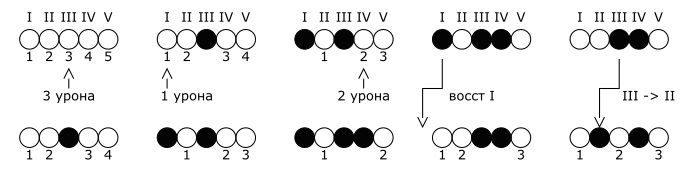
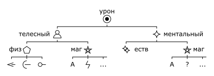
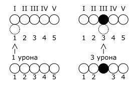

# 3 Здоровье и статусы

## Здоровье

Персонаж имеет 2 линии здоровья: для телесного и для ментального здоровья соответственно.
Линия здоровья состоит из 5 слотов обозначаемых от `I` до `V` (читается _первый_, _пятый_), это число называется номер слота.

Слот здоровья может быть свободным или потерянным.
Свободные слоты обозначаются от `1` до `5` (читается _один_, _пять_), это число называется ступень слота.

>У Большого Бо свободны все слоты, поэтому для него номер и ступень совпадают: `I 1`, `II 2`, `III 3`, `IV 4`, `V 5`.
>
>У Анаксиэль потеряны слоты `I` и `IV`, поэтому для неё `II 1`, `III 2`, `V 3`.

При получении урона, персонаж теряет слот здоровья той же ступени что и величина урона.

>Большой Бо столкнулся с неприятностями и получает `2` урона, он теряет `II 2` слот телесного здоровья.
>Теперь для него `I 1`, `III 2`, `IV 3`, `V 4`.
>
>Бо продолжает попадать в неприятности и получает `1` урона, он теряет `I 1` слот телесного здоровья.
>Теперь для него `III 1`, `IV 2`, `V 3`.

Если у персонажа нет слота здоровья, который он мог бы потерять из-за полученного урона, персонаж теряет сознание.

>Бо, будучи тем кто он есть, получает `3` урона, он теряет `V 3` слот телесного здоровья.
>Теперь для него `III 1, IV 2`. Если Бо получит `3` или больше урона, он потеряет создание.

Персонаж по своему желанию может решить принять урон в слот выше ступенью чем требуется.

Во время полного отдыха персонаж может восстановить `2` слота.
При восстановлении потерянный слот становится свободным за счет потери свободного слота ниже;
другими словами - урон перекладывается на один слот вниз.
Слот `I` можно восстановить всегда.

Хорошие условия отдыха увеличивают число освобождаемых слотов до `3`, плохие - уменьшают до `1`.

>Бо укладывается в королевскую постель после сытного ужина и промывания ран, он может освободить `3` слота.
>Бо освобождает слот `I`. Затем `II -> I`, и `V -> IV`.
>Теперь для Бо `II 1`, `III 2`, `V 3`.

>Витмор теряет `I`, `II` и `III` слоты ментального здоровья, изучая записки безумцев ночь напролет.
>Она спит весь день и следующую ночь, поэтому также освобождает `3` слота.
>Витмор освобождает `I`, затем `II -> I` и снова `I`.
>Теперь для Витмор `I 1,` `II 2`, `IV 3`, `V 4`.

>Анаксиэль получает `3` урона, затем `1` и затем `2`, после чего восстанавливает `I` и `III -> II`.

## Группы, типы, подтипы урона

Классификация урона обозначается как _Группа : Тип : Подтип_.

Весь урон делится на две группы:
- Телесный.
- Ментальный.

Телесный урон делится на два типа:
- Телесный : Физический.
- Телесный : Магический.

Телесный физический урон делится на три подтипа:
- Телесный : Физический : Колющий.
- Телесный : Физический : Режущий.
- Телесный : Физический : Дробящий.

Телесный магический урон делится на множество подтипов, некоторые из них:
- Телесный : Магический : Арканный.
- Телесный : Магический : Огненный.
- Телесный : Магический : Электрический.
- ...

Ментальный урон делится на два типа:
- Ментальный : Естественный.
- Ментальный : Магический.

Ментальный магический урон делится на множество подтипов, некоторые из них:
- Ментальный : Магический : Арканный.
- Ментальный : Магический : Мистический.
- ...

Классификация урона влияет на то, какая линия здоровья примет урон.
Иногда персонажи могут обладать уязвимостью или устойчивостью к определенному классу урона,
что влияет на их модификатор защиты; или же полной невосприимчивостью к определённому классу урона.

## Статусы

Статусы - прочие состояния, не являющиеся физическими или ментальными повреждениями,
такие как _удушье_, _отравление_, _голод_, _усталость_, _обморожение_.

При подвержении статусу персонаж получает линию этого статуса.
Правила потери слотов действуют так же как и для здоровья.
При потере всех свободных слотов возможны различные эффекты, зависящие от самого статуса.

Восстановление и облегчение статусов также целиком зависит от их природы.

>Герои третий день путешествуют через всю страну, не давая себе отдохнуть, они приобретают статус _Усталость_.
>
>Мастер решает, что при потере всех слотов, персонаж просто рухнет и будет беспробудно спать.
>
>Мастер также решает, что все слоты вернутся при полном отдыхе.

## Временные слоты

Иногда персонажи могут получать временные слоты здоровья.
Временные слоты могут быть любого уровня.
Линия здоровья не может иметь больше 1 временного слота каждого номера.

При получении урона временный слот полностью исчезает. При этом временный слот теряется первоочереднее чем обычный.

>Анаксиэль выпивает зелье защиты и получает временный слот `(I)` ментального здоровья.
>Теперь для неё `I (I) 1`, `II 2`, `III 3`, `IV 4`, `V 5`. 
>Когда Анаксиэль получает 1 ментального урона, он теряет слот `(I)`.

Временные слоты также учитываются при потере сознания.

>Витмор потеряла все слоты ментального здоровья, но всё ещё имеет временный слот `(III)`, поэтому находится в сознании.

Временные слоты полностью исчезают при полном отдыхе. Их нельзя использовать для восстановления обычных слотов.

>