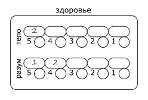
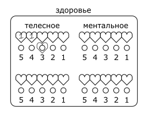

# 3 Здоровье

## Здоровье, раны и регенерация

Персонаж имеет `2` **линии здоровья**: для телесного и для ментального здоровья соответственно.
Линия здоровья состоит из `5` **слотов**.
Слоты нумеруются в обратном порядке от `5` до `1`, это число называется **уровень слота**.

Когда персонаж получает урон, величина этого урона записывается свободный слот самого высокого уровня.
Записанный урон называется **раной**, а число - **уровнем раны**.

>
>
>Анаксиэль получила 1 телесную рану в 2 урона и 2 ментальные раны: сначала 1 урона, затем 2.

Если все слоты уже заняты, урон прибавляется к ране в слоте самого низкого уровня.

Раны величиной в `0` урона также записываются в свободный слот самого высокого уровня,
однако при следующем получении урона новая рана записывается поверх `0`.
Если рана, записанная поверх `0`, также имеет величину `0`, `0` заменяется на `1`.

Если уровень раны равен илы выше уровня слота, в который она записана, персонаж теряет сознание.

>Если Анаксиэль получит 4 или больше телесного урона, либо 3 или больше ментального - она потеряет сознание.

Если уровень раны в слоте самого низкого уровня равен или выше самого высокого уровня слота, персонаж умирает.

Во время отдыха персонаж **регенерирует**.
Все раны `0` уровня исчезают во время регенерации.
При регенерации персонаж выбирает линию здоровья, которую хочет восстановить.
Самая правая рана на этой линии теряет `1` уровень.

В обычных условиях персонаж регенерирует:
- 1 раз за короткий отдых.
- 2 раза за полный отдых (8 часов сна).
- 3 раза за отдых на целые сутки.

Без сознания персонаж регенерирует:
- 1 раз за полный отдых.
- 2 раза за отдых на целые сутки.

Качество отдыха может увеличить или уменьшить количество регенераций.

>Анаксиэль укладывается в хорошую постель после сытного ужина и промывания ран, она регенерирует 3 раза.
>2 регенерации Анаксиэль направляет на ментальное здоровье, 1 на телесное.
>К утру у неё остается только 1 ментальная рана в 1 урона.

Если у персонажа без сознания в результате регенерации уровни ран опустили ниже уровней слотов,
персонаж приходит в себя.

## Временные слоты

Иногда персонажи могут получать **временные слоты здоровья**.
Уровень временного слота указывается в скобках от `(1)` до `(5)`.
Временный слот помечается под основным.

>
>
>Большой Бо имеет 2 телесные раны по 1 урона и временный слот телесного здоровья (3).

Временный слот может принять рану вместо основного слота совпадающего уровня,
но только если уровень этой раны не превышает уровень слота.
При получении урона временный слот полностью исчезает вместе с раной.

>Если Бо получит 3 урона, он сможет принять рану во временный слот.
>Если Бо получит 4 урона, он сможет принять рану только в постоянный слот, после чего потеряет сознание.

Персонаж не может иметь больше `1` временного слота здоровья каждого уровня.

## Классификация урона

- Телесный
- - Физический
- - - Колющий
- - - Режущий
- - - Дробящий
- - Магический
- - - Арканный
- - - Огненный
- - - Электрический
- - - ...
- Ментальный
- - Естественный
- - Магический

Классификация урона обозначается как _Группа - Тип - Подтип_.

>Удар кулаком наносит _Телесный - Физический - Дробящий урон_.
>
>Огненный шар наносит _Телесный - Магический - Огненный урон_.
>
>Чтение проклятых записей наносит _Ментальный - Естественный урон_.

Урон может иметь смешанный подтип, относясь сразу к двум подтипам.

>Удар горящим мечом имеет смешанный _Режущий_ и _Огненный_ урон.

Группа урона влияет на то, какая линия здоровья примет урон.

Персонажи могут иметь уязвимостью или устойчивостью к определенному подтипу урона,
что даёт им препятствия или преимущества на проверки защиты от этого типа урона.

Для смешанного урона уязвимость применяется, если персонаж уязвим хотя б к одной составляющей урона;
устойчивость применяется, если персонаж устойчив ко всем составляющим урона.

## Статусы

**Статусы** - прочие состояния, не являющиеся физическими или ментальными повреждениями,
такие как _удушье_, _отравление_, _голод_, _усталость_, _обморожение_.

При подвержении статусу персонаж получает линию этого статуса.
Правила потери слотов действуют так же как и для здоровья.
При превышении уровнем раны уровня слота возможны различные эффекты, зависящие от самого статуса.

Регенерация статусов также целиком зависит от их природы.

>Герои третий день путешествуют через всю страну, не давая себе отдохнуть, они приобретают статус _Усталость_.
>
>Мастер решает, что при получении слишком тяжелой "раны усталости", персонаж просто рухнет и будет беспробудно спать.
>
>Мастер также решает, что все "раны усталости" целиком регенерируются при полном отдыхе.