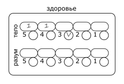

# 3 Здоровье

## Слоты и раны

Персонаж имеет `2` шкалы здоровья: телесное и ментальное.
Шкала здоровья состоит из `5` слотов.
Слоты нумеруются в обратном порядке от `5` до `1`, это число называется уровень слота.

Когда персонаж получает урон, величина этого урона записывается свободный слот самого высокого уровня.
Записанный урон называется раной, а число - уровнем раны.
Слот, содержащий рану, называется занятым; не содержащий - свободным.

>
>
>Анаксиэль получила 1 телесную рану в 2 урона и 2 ментальные раны: сначала 1 урона, затем 2.

Если все слоты уже заняты, урон прибавляется к ране в слоте самого низкого уровня.

Раны величиной в `0` урона записываются так же как и обычные раны,
однако следующая полученная рана заменяет собой `0` уровневую.
Если рана, заменяющая `0` уровневую также имеет `0` уровень, `0` заменяется на `1`.

Если уровень раны равен или выше уровня слота, в который она записана, персонаж теряет сознание.

>Если Анаксиэль получит 4 или больше телесного урона, либо 3 или больше ментального - она потеряет сознание.

Если уровень раны в слоте самого низкого уровня равен или выше самого высокого уровня слота, персонаж умирает.

## Регенерация

Во время отдыха персонаж регенерирует.
Все раны `0` уровня исчезают во время регенерации.
При регенерации персонаж выбирает линию здоровья, которую хочет восстановить.
Рана в слоте наименьшего уровня на этой линии теряет `1` уровень.

В обычных условиях персонаж регенерирует:
- 1 раз за короткий отдых.
- 2 раза за полный отдых (8 часов сна).
- 3 раза за отдых на целые сутки.

Качество отдыха может увеличить или уменьшить количество регенераций.

>Анаксиэль укладывается в хорошую постель после сытного ужина и промывания ран, она регенерирует 3 раза.
>2 регенерации Анаксиэль направляет на ментальное здоровье, 1 на телесное.
>К утру у неё остается 1 телесная и 1 ментальная рана, обе по 1 урона.

Если у персонажа без сознания в результате регенерации уровни ран опустили ниже уровней слотов,
персонаж приходит в себя.

## Временные слоты

Иногда персонажи могут получать временные слоты здоровья.
Уровень временного слота указывается в скобках от `(1)` до `(5)`.
На листе перснажа временный слот помечается отдельно.

>
>
>Большой Бо имеет 2 телесные раны по 1 урона и временный слот телесного здоровья (3).

Временный слот может принять рану вместо основного слота совпадающего уровня,
но только если уровень этой раны не превышает уровень слота.
При получении урона временный слот полностью исчезает вместе с раной.

>Если Бо получит 3 урона, он сможет принять рану во временный слот.
>Если Бо получит 4 урона, он сможет принять рану только в постоянный слот, после чего потеряет сознание.

Персонаж не может иметь больше `1` временного слота здоровья каждого уровня.

## Классификация урона

- Телесный
  - Физический
    - Колющий
    - Режущий
    - Дробящий
  - Магический
    - Арканный
    - Огненный
    - Электрический
    - ...
- Ментальный
  - Естественный
  - Магический

Классификация урона обозначается как _Группа - Тип - Подтип_.

>Удар кулаком наносит _Телесный - Физический - Дробящий урон_.
>
>Огненный шар наносит _Телесный - Магический - Огненный урон_.
>
>Чтение проклятых записей наносит _Ментальный - Естественный урон_.

Урон может иметь смешанный подтип, относясь сразу к двум подтипам.

>Удар горящим мечом имеет смешанный _Режущий_ и _Огненный_ урон.

Группа урона влияет на то, какая линия здоровья примет урон.

Персонажи могут иметь уязвимостью или устойчивостью к определенному подтипу урона,
что даёт им препятствия или преимущества на проверки защиты от этого типа урона.

Для смешанного урона уязвимость применяется, если персонаж уязвим хотя б к одной составляющей урона;
устойчивость применяется, если персонаж устойчив ко всем составляющим урона.