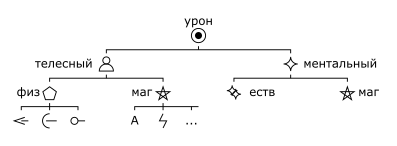

# 3 Здоровье

## Слоты и раны

Персонаж имеет `2` шкалы здоровья: для телесного и ментального здоровья соответственно.
Каждая шкала здоровья состоит из `5` слотов.
Слоты нумеруются слева направо по убыванию от `5` до `1`, это число называется уровень слота.
Таким образом самый левый слот имеет уровень `5`, самый правый - `1`.

Когда персонаж получает урон, величина этого урона записывается в слот здоровья:
- Если в каком-либо из слотов записан урон `0`, то текущий урон записывается вместо него.
  - Если текущий урон также равен `0`, записывается `1`.
- Если все слоты уже заняты, текущий урон прибавляется к значению в самом правом слоте.
- Во всех остальных случаях величина урона записывается в самый левый из свободных слотов.

Записанный урон называется раной, а число - уровнем раны.
Слот, содержащий рану, называется занятым; не содержащий - свободным.

>
>
>Анаксиэль получила 1 телесную рану в 2 урона и 2 ментальные раны: сначала 1 урона, затем 2.

Если уровень раны равен или выше чем уровень слота, в который она записана, персонаж теряет сознание.

>Если Анаксиэль получит 4 или больше телесного урона, либо 3 или больше ментального - она потеряет сознание.

Если уровень раны в самом правом слоте равен или выше чем уровень самого левого слота, персонаж умирает.

## Регенерация

Во время отдыха персонаж регенерирует.
Все раны `0` уровня исчезают во время регенерации.
При регенерации персонаж выбирает линию здоровья, которую хочет восстановить.
На этой линии рана в самом правом из занятых слотов уменьшает свой уровень на `1`.

В обычных условиях персонаж регенерирует:
- 1 раз за короткий отдых.
- 2 раза за полный отдых (8 часов сна).
- 3 раза за отдых на целые сутки.

Качество отдыха может увеличить или уменьшить количество регенераций.

>Анаксиэль укладывается в хорошую постель после сытного ужина и промывания ран, она регенерирует 3 раза.
>2 регенерации Анаксиэль направляет на ментальное здоровье, 1 на телесное.
>К утру у неё остается 1 телесная и 1 ментальная рана, обе по 1 урона.

Если у персонажа без сознания в результате регенерации уровни ран опустили ниже уровней слотов,
персонаж приходит в себя.

## Временные слоты

Иногда персонажи могут получать временные слоты здоровья.
Временные слоты также имеют уровни.

>
>
>Большой Бо имеет 2 телесные раны по 1 урона и временный слот телесного здоровья 3 уровня.

Когда персонаж получает урон, он может использовать временный слот здоровья, при этом:
- Использовать временный слот здоровья можно только, если его уровень равен или меньше чем величина текущего урона.
- Слот исчезает, независимо от величины урона.
- Персонаж полностью игнорирует текущий урон.

>Если Бо получит 3 урона, он сможет использовать временный слот.
>Если Бо получит 4 урона, он не сможет использовать временный слот, урон превратится в телесную рану и Бо потеряет сознание.

Персонаж не может иметь больше `1` временного слота здоровья каждого уровня.

## Классификация урона

- Телесный
  - Физический
    - Колющий
    - Режущий
    - Дробящий
  - Магический
    - Арканный
    - Огненный
    - Электрический
    - ...
- Ментальный
  - Естественный
  - Магический

Классификация урона обозначается как _Группа - Тип - Подтип_.

>Удар кулаком наносит _Телесный - Физический - Дробящий урон_.
>
>Огненный шар наносит _Телесный - Магический - Огненный урон_.
>
>Чтение проклятых записей наносит _Ментальный - Естественный урон_.

Урон может иметь смешанный подтип, относясь сразу к двум подтипам.

>Удар горящим мечом имеет смешанный _Режущий_ и _Огненный_ урон.

Группа урона влияет на то, какая линия здоровья примет урон.

Персонажи могут иметь уязвимостью или устойчивостью к определенному подтипу урона,
что даёт им препятствия или преимущества на проверки защиты от этого типа урона.

Для смешанного урона уязвимость применяется, если персонаж уязвим хотя б к одной составляющей урона;
устойчивость применяется, если персонаж устойчив ко всем составляющим урона.