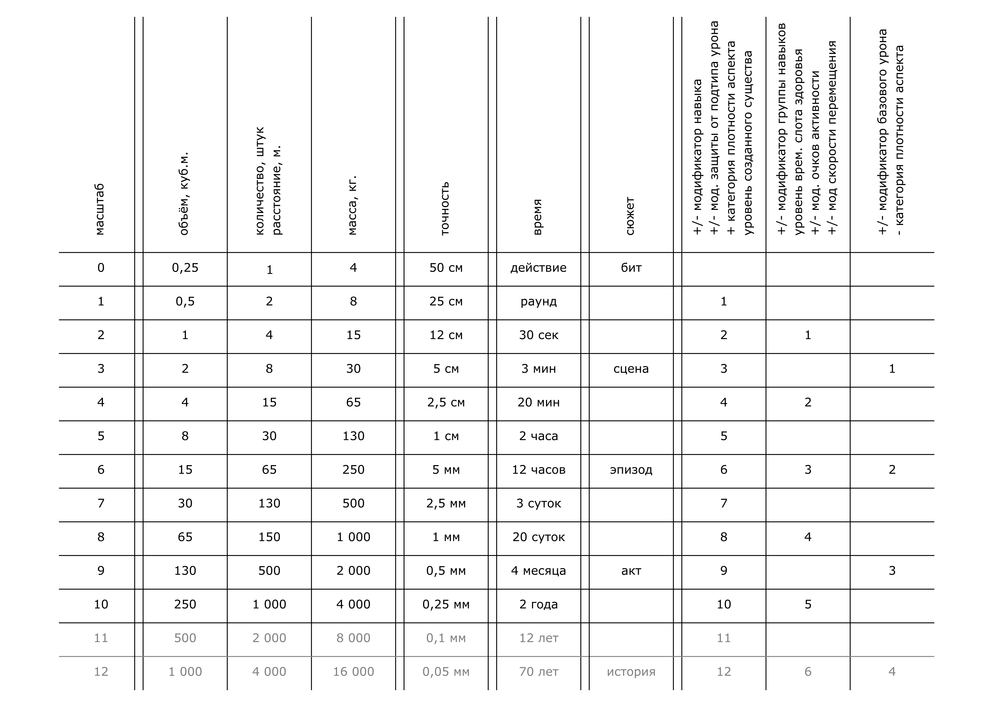

# 4 Способности

**Способность** - приобретенное умение, способность означает саму возможность выполнения определённого действия.

## Список способностей

Средневековье:
- _Алхимия_.
- _Кузнечное дело_.
- _Механика_.

Стимпанк:
- _Паровая механика_.

Современность и киберпанк:
- _Хаккинг_.

## Использование способностей

Единократное использование способностей называется **свершением**.

Свершение осуществляется следующим способом:
- Персонаж выбирает одну или несколько **плетений** вида "Способность - Цель - Масштаб".
  Среди плетений не может быть таких, у которых совпадает часть "Способность - Цель".
  Сумма масштабов всех плетений не должна превышать `уровень персонажа`.
- Часть "Способность" выбирается из способностей, которыми владеет персонаж.
- "Цель" означает результат, достигаемый использованием выбранной способности, и соответствует столбцу в таблице.
- "Масштаб" - число, означающее размер достигаемого результата, и соответствуют строке в таблице.

Значения в ячейках читаются как "включительно до".

>Витмор на 6 уровне может сделать свершение следующего вида:
>- Алхимия - + уровень временного слота здоровья - 2 => зелье, дающее временный слот здоровья 1 уровня.
>- Алхимия - Время - 4 => это зелье будет действовать 20 минут.

Столбец Сюжет используется, если результат использования способности невозможно описать численно.
Сила воздействия не-численных способностей оценивается по тому, на исход какой части истории она влияет.
Влияет - значит _изменяет вероятность того или иного исхода_, а не _однозначно определяет результат_.

## Использование способностей в качестве навыков

Зачастую способности отображают не только возможности персонажа что-то совершить,
но и компетентность в связанных областях, что делает их одновременно и способностью и навыком.
Изученная способность может быть использована как изученный навык при проверке навыка.

>Витмор пытается понять, что за зелье она обнаружила в тайнике.
>Она проходит проверку навыка алхимии, несмотря на то, что алхимия это способность.

## Доработка

Если результат свершения не исчезает мгновенно, а продолжает существовать, персонаж может его доработать.

При доработке предыдущее свершение получает свойства ещё одного,
но персонажу требуется пройти проверку навыка используемой способности.
Сложность этой проверки увеличивается на `5` за каждую доработку.

>На 1 уровне Витмор варит зелье:
>- Алхимия - + модификатор навыка - 1 => зелье ловкости, модификатор акробатики +1.
>
>Зелье продолжает существовать в колбе, поэтому Витмор может его доработать, пройдя проверку Алхимии против 5:
>- Алхимия - Время - 1 => это зелье будет действовать раунд.
>
>Пройдя проверку против 10, Витмор может ещё раз доработать зелье:
>- Алхимия - Время - 1 => теперь оно будет действовать 2 раунда.

>Витмор использует реагенты, чтобы создать вспышку света, которая ослепит противника:
>- Алхимия - Время - 1 => слепота продлится 1 действие.
>
>Витмор не может доработать это свершение, потому что вспышка света случалась мгновенно и больше не существует.

## Перегрузка

При помощи **перегрузки** персонаж может:
- Использовать большую сумму масштабов чем `уровень персонажа`,
  но при этом не может использовать масштаб больше чем `уровень персонажа` в одном плетении.
- Иметь 2, но не больше, плетения, у которых совпадает часть "Способность - Цель".

При перегрузке персонаж получает `1` ментального урона,
от этого урона нельзя защититься, его нельзя принять во временный слот.

Уровень персонажа | Максимальная сумма масштабов при перегрузке
---|---
2 | 3
3 | 6
4 | 10
5 | 15
6 | 21
7 | 28
8 | 36
9 | 45
10 | 55

>Витмор на 6 уровне делает свершение с перегрузкой:
>- Алхимия - + модификатор базового урона - 6 => бомба, наносящая 2 урона огнем.
>- Алхимия - Сюжет - 3 => урон не будет наноситься союзникам.
>- Алхимия - Объём - 6 => взрыв будет создавать кольцо огня площадью в 15 квадратных метров и высотой в 1 метр.
>- Алхимия - - модификатор группы навыков - 4 => попавшие под взрыв противники получат модификатор -2 физических навыков.
>- Алхимия - Время - 2 => модификатор физических навыков будет действовать 30 секунд.
>
>Итого 21 очко масштаба из 21 возможного.

## Синергия

**Синергия** - совместное свершение нескольких персонажей, при этом:
- Используется совместная проверка навыков всех участников.
- Эффекты свершений комбинируются.
- Все участники получают ментальную рану `урон = количество участников - 1`,
  от этого урона нельзя защититься, его нельзя принять во временный слот.