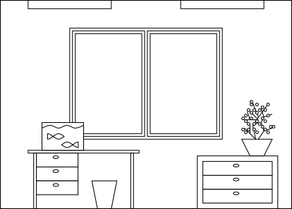
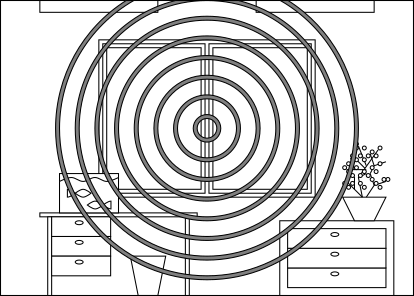
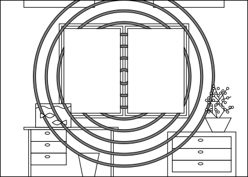

# 2 Сцены расследования

## Улики

Расследование строится на обнаружении и анализе улик. **Улика** - имеющая значение для расследования информация.

>Улике не обязательно быть предметом, это могут быть показания персонажа или факт, что в определенное время шел дождь.

По влиянию на ход расследования и сюжета улики делятся на:
- **Ключевые** - без них продвижение дальше невозможно.
- **Дополнительные** - без них продвижение дальше возможно, не обязательно наиболее оптимальным или верным путём.

По способу обнаружения улики делятся на:
- **Очевидные** - персонажу достаточно оказаться рядом с уликой.
- **Неочевидные** - персонажу необходимо правильно или тщательно искать, задать верный вопрос.
- **Специальные** - персонажу необходимо владеть определённым навыком, знаниями или пройти проверку навыка.

>Нож в спине жертвы, записка о похищении, выбитая дверь - очевидные улики.
>
>Следы на подоконнике, закатившийся под шкаф монокль - неочевидные улики.
>
>Понять тип яда по следам на теле, определить насколько умело нанесен удар шпагой - специальные улики.

Ключевые улики по умолчанию должны быть очевидными.
Ключевые улики могут быть неочевидными или специальными, если обнаружение других ключевых улик рано или поздно сделает эти очевидными,
или у персонажей есть какой-либо другой способ сделать их очевидными.

>Герои осматривают комнату, где хранился ключ.
>Замок не взломан (ключевая улика), на это указывает владелец дома,
>который разбирается в замках (очевидная за счет персонажа).
>От окна комнаты до окна соседнего дома меньше метра (ключевая улика),
>героям достаточно осмотреть комнату чтобы это заметить (очевидная).

Дополнительные и специальные улики могут быть любыми по способу обнаружению.

>В комнате есть следы применения магии (дополнительная улика),
>которые пытались замаскировать (неочевидная, требует тщательного осмотра).
>Это была магия аспекта металла (дополнительная улика, специальная, персонажи должны быть знакомы с магией металла).

## Следы магии

Магия течёт через всё существующее.
Через твёрдые тела - труднее чем через жидкости, а через жидкости - труднее чем через газы.
Единственное исключение - живые тела, которые проводят магию куда легче, чем должны.

Некоторые вещества в твёрдом виде настолько сильно блокируют течение магии, что мешают применять заклинания.
Такие вещества называют диа-магическими.

Магические явления, в том числе заклинания, оставляют следы - уплотнения на магическом поле,
которые подобно кругам на воде впечатываются в окружение.
Круги тем интенсивнее, больше в размерах и дольше присутствуют, чем сильнее было заклинание.

Все магические существа способны использовать магическое зрение (или другой способ восприятия), чтобы увидеть следы магии.

Следы магии тем интенсивнее, чем больше очков способностей было использовано.

Магические существа могут маскировать следы своей магии.
Для этого необходимо использовать способности, обратные использованным при сотворении оригинального заклинания,
требуется использовать столько же очков способностей.

Следы имеют свойства, которые можно за неимением аналогов назвать цветом и текстурой.
Цвет зависит от аспекта магии. Текстура зависит от использованной при сотворении заклинания способностей.

Заклинатели без проблем идентифицируют свой аспект, знакомые им способности и тем более заклинания.
Незнакомые способности, аспекты, необычное применение, неочевидные заклинания осложняют определение всех параметров.

Раундов, потраченных на использование магического зрения | Получаемая информация о следах
---|---
1 | Наличие или отсутствие
2 | Интенсивность
3 | Цвет и текстура

>

>Заклинание применяется в центре комнаты.
>
>

>Следы магии в воздухе за окном, на рыбах и цветке растворяются. 
>
>

>Следы магии в воде растворяются.
>
>

>Кто-то подвинул комод.
>
>