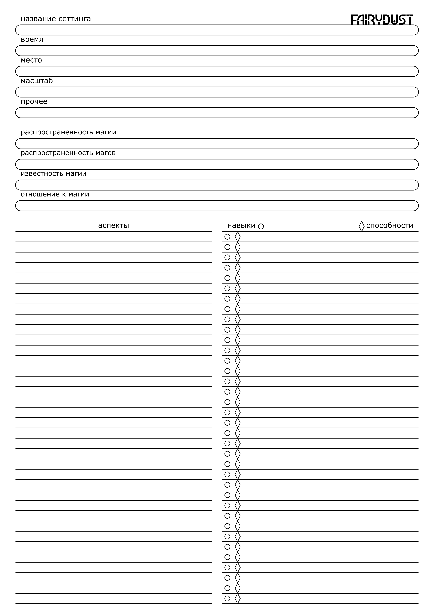

# Лист сеттинга

## Общая информация

- Время - исторический период, в который происходит действие игры.

>Средневековье, современность, отдалённое будущее, каменный век.

- Место - локация, в котрой проихсодит действие игры. 

>Мегаполис, захолустье, космическая стация, бесконечный лес, дикий запад, подземный мегакомплекс.

- Масштаб - насколько крупным является действие игры по отношению к миру.

>Истории имеет дело с вопросами всего мира или же "мир" ограничивается личными проблемами героев.

- Прочее - все другие особенности сеттинга, не вошедшие в предыдущие пункты.

>Альтернативная история, стимпанк, контакт с неземной цивилизацией, порталы в другие миры.

## Информация о магии

- Распростренённость магии - как часто чистая магия, магические явления и предметы встречаются в мире.

>Пост-средневековый мир, в которой магия повсюду и заменяет роль электричества, приводя в действие бытовые приборы.
>
>Мир, в котором магический предмет - сокровище, ради которого можно рисковать жизнями.

- Распространённость магов - как часто встречаются владеющие магией люди, магические животные и состоящие целиком из магии существа.

>Мир, где магические предметы и дикая магия встречаются повсюду, но самих магов крайне мало.
>
>Мир, в котором единственный источник магии - сами заклинатели.

- Известность магии - известно ли о магии рядовому жителю мира.

>Маги прячутся в подпольных ковенах и гильдиях, скрывая своё искусство.
>
>Основы магии изучают в школе, маги появляются в медиа.

- Отношение к магии - какое место в обществе занимает магия и маги.

>Магия - обыденное явление, встречающееся повсюду, никто не питает к ней каких-то особенных чувств.
>
>Магия - высший дар, который нужно лелеять / опасное явление, которого нужно бояться.

- Распространенность аспектов - какие аспекты и как часто встречаются конкретный мире.

>В мире без надежды нет места аспекту Света.
>
>В стимпанке аспект ремесла встречается всё чаще и чаще.

- Отношение к аспектам - какое место в обществе занимает конкретный аспект.

>Магия крови и оживление мертвецов запрещены, в то время как свет превозносится.
>
>Считается, что молния и огонь крайне нестабильны, поэтому ими владеют только безумцы.

