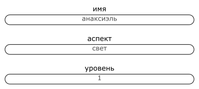
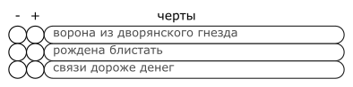
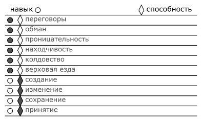
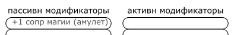
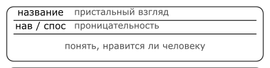
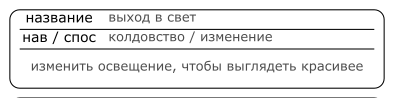

# 2 Создание персонажа

## Имя, концепт и характер

Начать создание персонажа можно с имени, концепта или характера.

>Яна, будучи мастером, подготовила сценарий игры, где персонажи игроков поучаствуют в охоте за сокровищами.
>Анна, Бриджит и Виолетта создают персонажей.
>
>Анна начинает с имени - _Анаксиэль Третья_. Исходя из этого она понимает, что её персонаж скорее всего дворянка.
>
>Бриджит начинает с концепта - её персонаж будет боевым магом земли. Она решает, что его будут звать _Большой Бо_.
>
>Виолетта начинает с характера - её персонаж будет сухой учёной-заучкой. Она выбирает имя _Витмор Смит_.

## Уровень и очки развития

Уровень описывает меру владения персонажа своими навыками и способностями.
Уровень принимает значения от `0` до `10`.
Уровень, с которым персонажи начинают историю, определяется мастером.

>Яна решает, что игроки начнут историю с 1-ым уровнем.
>
>

Персонаж имеет `10` очков развития, эти очки расходуются на изучение навыков и способностей.

## Черты

Персонаж имеет `3` черты.
Черта – сюжетно важный факт о персонаже, способный быть как преимуществом, так и препятствием в ходе истории.

Черта:
- Описывает персонажа, выделяет его из множества других.
- Имеет однозначную трактовку в пределах игры, понятна всем игрокам.
- Характеризует персонажа сразу с нескольких сторон.

Рекомендуемые черты:
- Описывающая персонажа как протагониста,
отвечающая на вопросы _почему этот персонаж должен быть на переднем плане повествования_, _кто этот персонаж_.
- Описывающая персонажа как часть текущей истории,
отвечающая на вопросы _почему этот персонаж должен участвовать именно в этой истории_, _что этот персонаж хочет_.
- Описывающая персонажа как часть группы,
отвечающая на вопросы _почему этот персонаж должен взаимодействовать именно с этой группой_, _как персонаж связан с другими персонажами_.

На что можно опереться при создании черты:
- Характер персонажа.
- Происхождение.
- Род деятельности.
- Взаимоотношения.
- Цели.

Для придания черте многогранности можно сформулировать её как:
- Коронную фразу персонажа.
- Игру слов.

>Поскольку Анаксиэль дворянка, Анна решает, что ей движет жажда роскоши -
>Анаксиэль точно знает всему цену, но часто слабо контролирует свою алчность -
>эту черту Анна называет _Ворона из дворянского гнезда_.
>
>Большой Бо, несмотря на свой род занятий и пугающую внешность, внутри очень мягкий человек,
>ему легко добиться расположения людей, но только если те смогут разглядеть его самого за его обликом,
>Бриджет называет эту черту _Плюшевый. Медведь._
>
>Витмор Смит одержима своей работой археолога,
>она с лёгкостью решит любую археологическую загадку, но другой человек для неё останется загадкой навсегда,
>Виолетта называет эту черту _Книги понятнее чем люди_.
>
>

## Навыки

Персонаж может потратить `1` очко развития чтобы изучить навык.

Персонаж выбирает навыки из базовых навыков ([ссылка](../II_Основные_правила/1_Навыки.md))
и навыков сеттинга (предоставляются мастером).

>Анаксиэль тратит 4 очка развития, чтобы изучить навыки _переговоров_, _проницательности_, _обмана_ и _находчивости_.
>
>Бо тратит 3 очка развития, чтобы изучить навыки _рукопашного боя_, _атлетики_ и _проницательности_.
>
>Витмор тратит 2, чтобы изучить навыки _археологии_ и _анализа_.

## Способности

Персонаж может потратить `1` очко развития чтобы изучить способность.

Персонаж выбирает способности из базовых способностей ([ссылка](../II_Основные_правила/5_Магические_способности.md))
и способностей сеттинга (предоставляются мастером).

>Анаксиэль тратит 4 очка развития, чтобы изучить магические способности _создания_, _изменения_, _сохранения_ и _принятия_.
>
>

## Модификаторы и предметы

Модификаторы дополнительно прилагаются к уровням навыка, способностей или другим величинам.
Модификаторы появляются из-за эффектов, которым подвержен персонаж, событий, которые с персонажем произошли, и по многими другими причинам.

Один из источников модификаторов - предметы, которыми владеет персонаж.

Полный список доступных при создании персонажа придметов предоставляемом мастером.

>
>
>
>
>

## Таланты

Талант - более узкое использование навыка или способности.

Для талантов, основанных на навыке, условия, в которых можно применить талант, должны выполняться реже чем в половине случаев.

Для талантов, основанных на способности, должно быть определено конкретное использование этой способности.

Персонаж получает по 2 таланта с каждым уровнем.

На что можно опереться при создании таланта:
- Какое действие персонажу никак не хотелось бы провалить.
- Есть ли у персонажа таланты, связанные с расследованием, переговорами, боем или другой важной активностью.

>Талант Анаксиэль - понимать, нравится ли она человеку (более узкое использование навыка проницательности),
>Анна называет его _Пристальный взгляд_.
>
>Второй талант Анаксиэль - изменять освещение, чтобы выглядеть красивее (конкретное использование способности изменения),
>_Выйти в свет_.
>
>Талант Бо - подсечка с броском в сторону (навык атлетики), Бриджит называет его без изысков - _Подсечка_.
>
>Второй талант Бо - захват ноги при помощи земли (способность изменения), _Капкан_.
>
>Талант Витмор - быстро разобираться в новом материале (навык анализа), Виолетта называет его _Скорочтение_.
>
>Второй талант Витмор - оживлять небольших големов, собранных из подручных материалов (способность автономности),
>_Маленький помощник_.
>
>
>
>