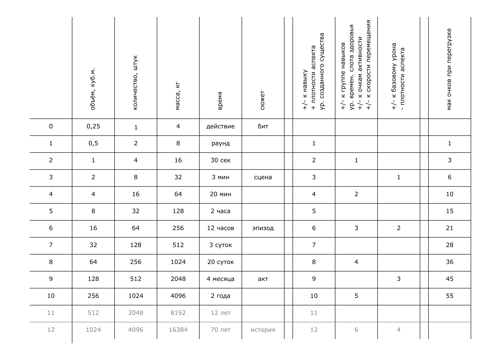

# 4 Способности

## Использование способностей

При использовании способностей персонаж выбирает:
- Какие из тренированных способностей использовать.
- Для какой цели использовать каждую из выбранных способностей.
- Сколько очков способностей использовать для каждой цели.

>Неожиданно для Яны в сюжете всё большую роль играет Эльгард - механик, у которого персонажи заказывают инструменты.
>Яна решает полностью прописать персонажа Эльгарда, на всякий случай.
>Эльгард имеет 5 уровень и 3 способности: _Конструирование_ , _Обслуживание_ и _Утилизация_.

При этом персонаж не может использовать:
- Больше очков способностей суммарно чем `уровень персонажа`.
- Одну и ту же способность для одной и той же цели более одного раза.

>Эльгард не может использовать 6 очков в _Конструировании_
>или 3 очка в _Конструировании_ + 3 в _Обслуживании_, т.к. его уровень 5.

При выполнении действия, способность влияет на:
- Количественный результат.
- Масштаб воздействия на мир.
- Степень воздействия на персонажей.

## Эффективность способностей - мир

При воздействии на внешний мир очки способности определяют масштабы этого воздействия по таблице ниже. 
Значения в ячейках читаются как _включительно до_.

Очки способности | Объём, куб.м | Количество | Масса, кг. | Время | Сюжет
---|---|---|---|---|---
0 | 0,25 | 1 | 4 | Действие | Бит
1 | 0,5 | 2 | 8 | Раунд | 
2 | 1 | 4 | 16 | 1/2 минуты | 
3 | 2 | 8 | 32 | 3 минуты | Сцена
4 | 4 | 16 | 64 | 20 минут | 
5 | 8 | 32 | 128 | 2 часа | 
6 | 16 | 64 | 256 | 12 часов | Эпизод
7 | 32 | 128 | 512 | 3 суток | 
8 | 64 | 256 | 1024 | 20 суток | 
9 | 128 | 512 | 2048 | 4 месяца | Акт
10 | 256 | 1024 | 4096 | 2 года | 
11 | 512 | 2048 | 8192 | 12 лет | 
12 | 1024 | 4096 | 16384 | 70 лет | История
13 | 2048 | 8192 | 32768 | 400 лет | 
14 | 4096 | 16384 | 65536 | 2,5 тыс лет | 
15 | 8192 | 32768 | 131072 | 15 тыс лет | 

Столбец Количество определяет количество областей, объектов или сущностей,
с которыми персонаж может взаимодействовать одновременно при помощи своей способности.

Столбец Сюжет используется, если результат использования способности невозможно описать численно.
Сила воздействия не-численных способностей оценивается по тому, на исход какой части истории она влияет.
Влияет - значит _изменяет вероятность того или иного исхода_, а не _однозначно определяет результат_.

Значения, не указанные в таблице определяются косвенно. Например, точность - обратно пропорционально объёму.

>Игроки просят Эльгарда починить дешифратор, который недавно нашли.
>Яна решает, что его использование по влиянию на сюжет равно влиянию на исход сцены.
>Эльгард использует 3 очка в _Обслуживание_, чтобы починить дешифратор
>(способность - Обслуживание, цель - Прочее, количество очков - 3).
>
>Игроки просят Эльгарда изготовить арбалет, стреляющий крюком-кошкой.
>Яна решает, что его использование лежит между влиянием на бит и сцену.
>Эльгадр использует 2 очка _Конструирования_, чтобы изобрести такой арбалет (Конструирования, Прочее, 2)
>и ещё 3 очка _Конструирования_, чтобы собрать 8 таких арбалетов (Конструирования, Количество, 3), суммарно 5 очков.
>
>Эльгард не может использовать 1 очко _Конструирования_, чтобы собрать 2 арбалета,
>а затем ещё раз 1 очко _Конструирования_, чтобы собрать ещё 2 арбалета,
>т.к. это будет использование одной и той же способности для одной и той же цели.

## Эффективность способностей - персонаж

При воздействии на персонажа очки способности определяют масштабы этого воздействия по формулам ниже. 

`1` очко способности можно преобразовать в:
- Модификатор `+1` / `-1` к одному навыку.
- Повышение плотности аспекта на `1` категорию.
- `1` уровень создаваемого существа.

`2` очка способности можно преобразовать в:
- Модификатор `+1` / `-1` к группе навыков (модификатор защиты, атаки, высказывания, физических навыков, ментальных, социальных).
- `1` уровень временного слота здоровья.
- Модификатор `+1` / `-1` к очкам активности.
- Модификатор `+1` / `-1` к скорости перемещения.

`3` очка способности можно преобразовать в:
- Уменьшение плотности аспекта на `1` категорию.
- Модификатор `+1` / `-1` к базовому урону.

>Кузнец использует 2 очка _Создания оружия_, чтобы сделать нож с модификатором +1 к атаке
>и ещё 3 очка, чтобы повысить базовый урон ножа с 0 до 1.
>
>Алхимик использует 6 очков _Зельеварения_, чтобы создать зелье, дающее временный 2 слот телесного здоровья,
>и ещё 3 очка, чтобы зелье действовало 3 минуты.
>
>Механик использует 4 очка _Кустарных технологии_, чтобы прикрепить к бите конденсатор
>и повысить базовый урон электричеством с 0 до 1.

## Перегрузка

При помощи перегрузки персонаж может:
- Использовать больше очков способностей суммарно чем `уровень персонажа` (см таблицу),
  но при этом не может использовать больше чем `уровень персонажа` в каждой способности.
- Использовать одну и ту же способность для одной и той же цели дважды, но не больше раз.

При перегрузке персонаж получает `1` ментального урона.

Уровень персонажа | Максимум очков способностей при перегрузке
---|---
2 | 3
3 | 6
4 | 10
5 | 15
6 | 21
7 | 28
8 | 36
9 | 45
10 | 55

>При изготовлении арбалетов Эльгард мог бы использовать 
>2 очка _Конструирования_, чтобы изобрести его (Конструирование, Прочее, 2),
>5 очков, чтобы собрать 32 таких арбалета (Конструирование, Количество, 5),
>и ещё 5 очков (Конструирования, Количество, 5), чтобы собрать ещё 32, 
>суммарно 12 очков. При этом Эльгард получил бы `1` ментального урона.

## Синергия

Синергия - совместное использование способностей несколькими персонажами, при этом:
- Используется совместная проверка навыков всех участников.
- Эффекты способностей комбинируются.
- Все участники получают ментальный урон: `Урон = количество участников - 1`.

# Способности - полная таблица

