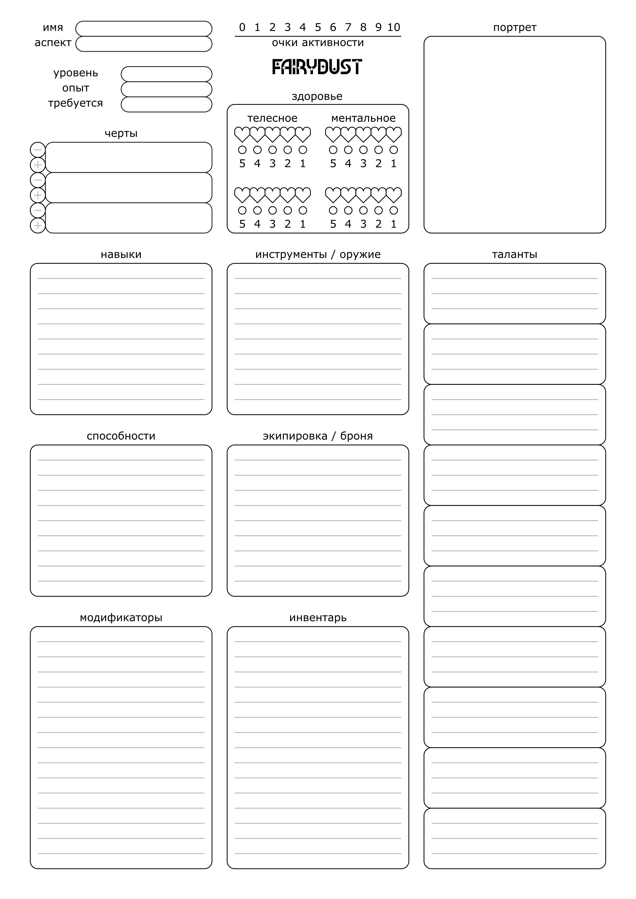
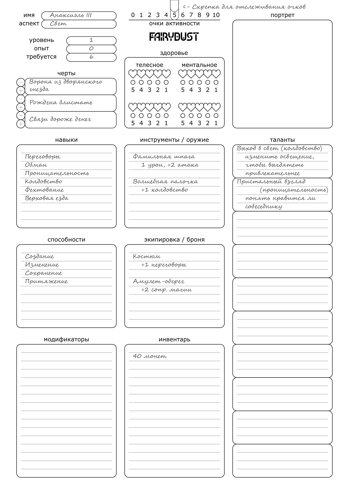

# 1 Создание персонажа

Чтобы создать персонажа, игрок заполняет лист, проходя через следующие шаги:
- Придумывает имя.
- Создает 3 черты, описывающие суть и характер персонажа.
- Выбирает аспект магии, подвластной персонажу.
- Выбирает известные персонажу навыки и способности, суммарно 10 штук в любой комбинации.
- Выбирает инструменты, экипировку и прочий инвентарь.
- Создает таланты.

Начать создание персонажа можно с имени, идеи или характера.

>Яна, будучи мастером, подготовила сценарий игры, где персонажи игроков поучаствуют в охоте за сокровищами.
>Анна, Бриджит и Виолетта создают персонажей.
>
>Анна начинает с имени - _Анаксиэль Третья_. Исходя из этого она понимает, что её персонаж скорее всего дворянка.
>
>Бриджит начинает с идеи - её персонаж будет боевым магом земли. Она решает, что его будут звать _Большой Бо_.
>
>Виолетта начинает с характера - её персонаж будет неловкой учёной. Она выбирает имя _Витмор Смит_.

Каждый шаг подробно описан в главах этого раздела.

