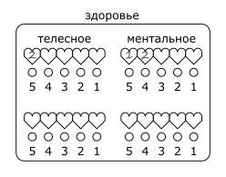
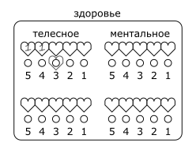

# 4 Здоровье

## Здоровье, раны и регенерация

Персонаж имеет `2` **линии здоровья**: для телесного и для ментального здоровья соответственно.
Линия здоровья состоит из `5` **слотов**.
Слоты нумеруются слева направо от `5` до `1`, это число называется **уровень слота**.

Когда персонаж получает урон, величина этого урона записывается в самый левый свободный слот.
Записанный урон называется **раной**, а число - **уровнем раны**.

>
>
>Анаксиэль получила 1 телесную рану в 2 урона и 2 ментальные раны: сначала 1 урона, затем 2.

Если уровень раны равен илы выше уровня слота, в который она записана, персонаж теряет сознание.

>Если Анаксиэль получит 4 или больше телесного урона, либо 3 или больше ментального - она потеряет сознание.

Во время отдыха персонаж **регенерирует**.
При регенерации персонаж выбирает линию здоровья, которую хочет восстановить.
Самая правая (последняя полученная) рана на этой линии теряет `1` уровень или исчезает при достижении `0` уровня.

В обычных условиях персонаж регенерирует:
- 1 раз за короткий отдых полный отдых.
- 2 раза за полный отдых.

Качество отдыха может увеличить или уменьшить количество регенераций.

>Анаксиэль укладывается в хорошую постель после сытного ужина и промывания ран, она регенерирует 3 раза.
>2 регенерации Анаксиэль направляет на ментальное здоровье, 1 на телесное.
>К утру у неё остается только 1 ментальная рана в 1 урона.

## Временные слоты

Иногда персонажи могут получать **временные слоты здоровья**.
Уровень временного слота указывается в скобках от `(1)` до `(5)`.
Временный слот помечается под основным.

>
>
>Большой Бо имеет 2 телесные раны по 1 урона и временный слот телесного здоровья (3).

Временный слот может принять рану вместо основного слота совпадающего уровня,
но только если уровень этой раны не превышает уровень слота.
При получении урона временный слот полностью исчезает вместе с раной.

>Если Бо получит 3 урона, он сможет принять рану во временный слот.
>Если Бо получит 4 урона, он сможет принять рану только в постоянный слот, после чего потеряет сознание.

Персонаж не может иметь больше `1` временного слота здоровья каждого уровня.

## Классификация урона

- Телесный
- - Физический
- - - Колющий
- - - Режущий
- - - Дробящий
- - Магический
- - - Арканный
- - - Огненный
- - - Электрический
- - - ...
- Ментальный
- - Естественный
- - Магический

Классификация урона обозначается как _Группа - Тип - Подтип_.

>Удар кулаком наносит _Телесный - Физический - Дробящий урон_.
>Огненный шар наносит _Телесный - Магический - Огненный урон_.
>Чтение проклятых записей наносит _Ментальный - Естественный урон_.

Классификация урона влияет на то, какая линия здоровья примет урон.
Иногда персонажи могут обладать уязвимостью или устойчивостью к определенному классу урона,
что влияет на их модификатор защиты; или же полной невосприимчивостью к определённому классу урона.

## Статусы

**Статусы** - прочие состояния, не являющиеся физическими или ментальными повреждениями,
такие как _удушье_, _отравление_, _голод_, _усталость_, _обморожение_.

При подвержении статусу персонаж получает линию этого статуса.
Правила потери слотов действуют так же как и для здоровья.
При превышении уровнем раны уровня слота возможны различные эффекты, зависящие от самого статуса.

Регенерация статусов также целиком зависит от их природы.

>Герои третий день путешествуют через всю страну, не давая себе отдохнуть, они приобретают статус _Усталость_.
>
>Мастер решает, что при получении слишком тяжелой "раны усталости", персонаж просто рухнет и будет беспробудно спать.
>
>Мастер также решает, что все "раны усталости" целиком регенерируются при полном отдыхе.