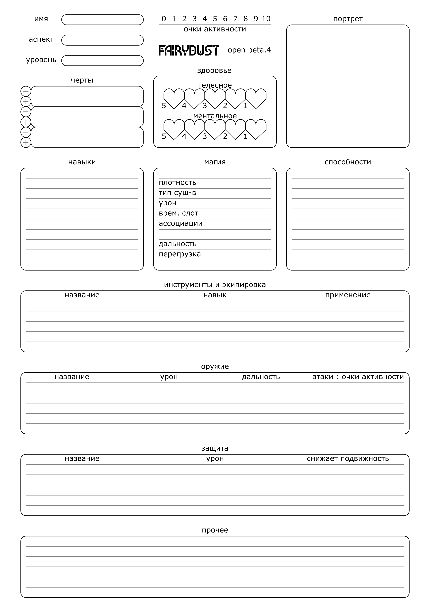

# 1 Создание персонажа

## Лист персонажа

Для описания и отслеживания состояния персонажа в мире игры используется лист персонажа.

При создании персонажа, игрок заполняет его лист.

>Яна, будучи мастером, подготовила сценарий игры, где персонажи игроков поучаствуют в охоте за сокровищами.
>Анна, Бриджит и Виолетта создают персонажей, заполняя листы.

Незнакомым с Fairydust игрокам рекомендуется заполнять лист персонажа в порядке глав в этом разделе:
- Выбрать имя, идею и характер.
- Выбрать сочетание количества навыков и способностей.
- Заполнить уровень.
- Выбрать [навыки](2_Навыки.md).
- Выбрать [аспект](4_Аспекты.md).
- Выбрать [способности](5_Способности.md).
- Создать [черты](6_Черты.md).
- Создать [таланты](7_Таланты.md).
- Выбрать [инвентарь](8_Инвентарь.md).

>Анна начинает с имени - _Анаксиэль Третья_. Исходя из этого она понимает, что её персонаж скорее всего дворянка.
>
>Бриджит начинает с идеи - её персонаж будет боевым магом земли. Она решает, что его будут звать _Большой Бо_.
>
>Виолетта начинает с характера - её персонаж будет неловкой учёной. Она выбирает имя _Витмор Смит_.

Знакомым с Fairydust рекомендуется заполнять лист персонажа в порядке разделов на самом листе:
- Выбрать имя, идею и характер.
- Заполнить уровень.
- Создать [черты](6_Черты.md).
- Выбрать [аспект](4_Аспекты.md).
- Выбрать сочетание количества навыков и способностей.
- Выбрать [навыки](2_Навыки.md) и [способности](5_Способности.md).
- Создать [таланты](7_Таланты.md).
- Выбрать [инвентарь](8_Инвентарь.md).

## Количество навыков и способностей, уровень

Персонаж может иметь одно из следующих сочетаний количества навыков и способностей:
- 9 навыков и 2 способности.
- 7 навыков и 3 способности.
- 5 навыков и 4 способности.
- 3 навыка и 5 способностей.

Уровень означает меру владения персонажа своими навыками и способностями, он описывается числом от `1` до `10`.
Уровень, с которым персонажи игроков начинают историю, выбирается мастером.

>Яна решает, что игроки начнут историю с 1-ым уровнем.

Персонажи повышают уровень по решению мастера при достижении важных точек в сюжете.